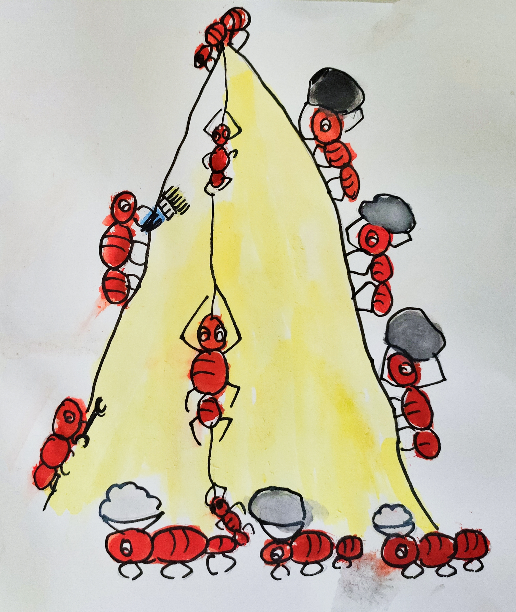

One Day, 12 ants were walking around the rock castle that their king had built. 
A fox came and broke the rock castle. 

The brave ants thought

> We should build another rock castle 

> Yes we have to build the castle in 5 days, before the king comes back.

> We should not paint it. If we paint the fox will break the rock castle again.

Then they started to build their rock castle. They collected rock and made a beautful rock castle.
When they finished it on the 4th day and went inside.

The silly fox came on the 5th day. When has saw the rock castle, he got very frightened and ran away as the rock castle was black and not painted. 
He vowed not to come to the beach anymore. 

It was the 6th day and the king was goig to come. The ants kept diamonds around the castle to make it look beautiful. When the king came back, he went inside to see his rock castle.  But the ants said

> Wait wait! Your magesty. This is a new rock castle, please see up, down and outside. If you like the rock castle, you can rule from there. 

told the ants.

The king saw the rock castle and it was very very very very very very very very very beautiful. So the ants painted the rock castle with golden color and the king liked it. 

So the king ruled from the rock castle and he felt very happy and the ants were happy that they built the rock castle.

